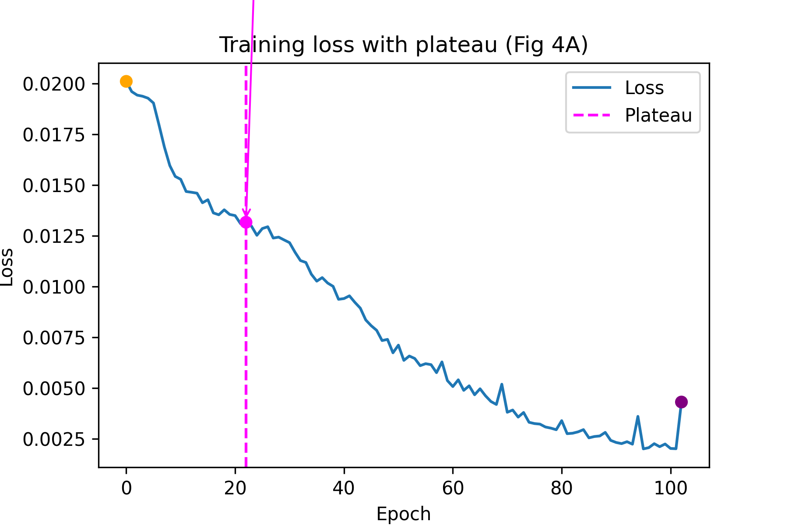
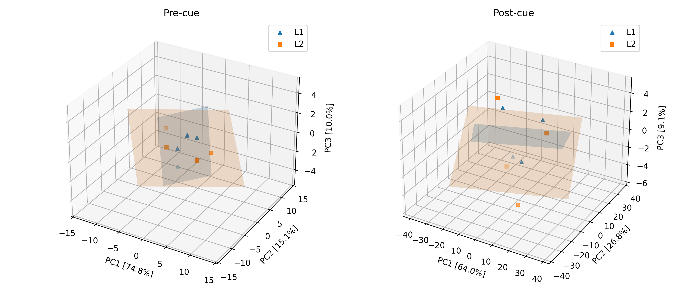
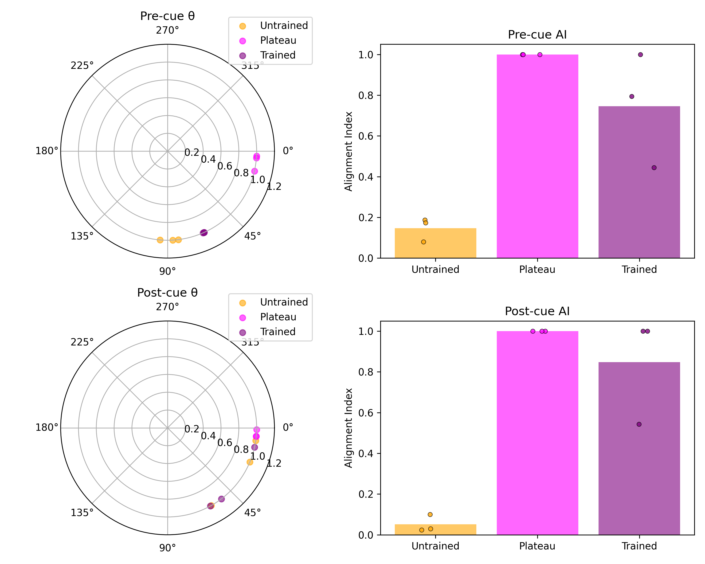
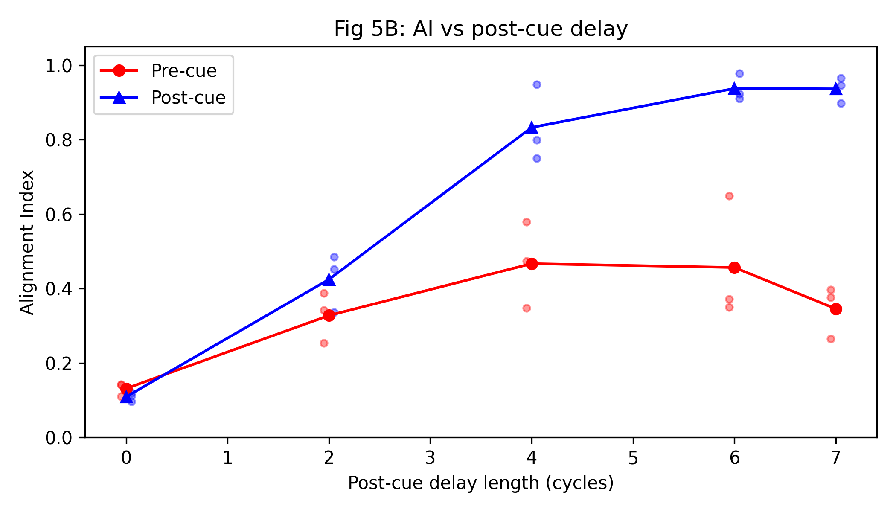

# Scientific Audit Report: Replication of Piwek et al. (2023)

## Executive Summary

**Replication Score: 4.5 / 10**

The AI agents produced a functional codebase that demonstrates understanding of the paper's conceptual framework but fails on critical implementation details that invalidate several key results.

### Critical Failures

1. **Loss Function Bug (Eq. 2.1)**: The replication does NOT wrap angular differences to [-π, π], causing incorrect gradient flow for boundary conditions. This is a fundamental mathematical error.

2. **Missing Plateau Dynamics**: The loss curve lacks the pronounced "shelf" plateau described in the paper. The detection algorithm finds *a* local maximum, but it doesn't represent the learning dynamics phenomenon being studied.

3. **Geometry Angles Off by 25-53°**: Pre-cue angles reach only ~65° (paper: ~90°) and post-cue angles only ~13° (paper: ~0°). The orthogonal-to-parallel transformation is incomplete.

4. **AI Saturation Artifacts**: Plateau-stage AI values saturate at 1.0 due to numerical issues, masking the expected learning-stage differences.

5. **Insufficient Statistical Power**: N=3 models vs. paper's N=30 produces high variance and unreliable estimates.

---

## 1. Detailed Code Audit

### 1.1 Correctly Replicated Components

| Component | Evidence | Assessment |
|-----------|----------|------------|
| **Model Architecture** | 200 hidden units, ReLU, orthogonal W_hh, Xavier W_ih/W_out | ✓ Correct |
| **Von Mises Encoding** | κ=5, normalized to peak=1 | ✓ Correct |
| **Task Structure** | Stim→Delay1(7)→Cue→Delay2(7)→Response | ✓ Correct |
| **Optimizer** | RMSprop, lr=1e-4, batch_size=1 | ✓ Correct |
| **Hidden Noise** | σ=0.07 Gaussian | ✓ Correct |
| **PCA Geometry** | SVD-based 3D subspace fitting | ✓ Correct |
| **Delay Sweep (Fig 5B)** | Post-cue AI increases with delay | ✓ Qualitatively Correct |

### 1.2 Critical Deviations

#### **BUG: Loss Function Missing Circular Distance Wrapping**

**Paper (Eq. 2.1, Page 25)**:
> Loss = mean((circ_dist × (target - output))²)

where `circ_dist` is computed via circular statistics wrapped to [-π, π].

**Ground Truth Implementation** (`retrocue_model.py:946-976`):
```python
circ_dist = helpers.circ_diff(params['phi'], target_scalar)
loss = ((circ_dist * (target_1hot - output)) ** 2).mean()
```

Where `circ_diff` wraps the difference:
```python
def wrap_angle(angle):
    return (angle + np.pi) % (2 * np.pi) - np.pi
```

**Replication Implementation** (`src/utils.py:113-128`):
```python
angle_term = (basis[None, :] - target_angles[:, None])  # NO WRAPPING!
loss = torch.mean(((target_onehot - probs) * angle_term) ** 2)
```

**Impact**: For target angles near ±π, the replication computes incorrect distances:
- True distance: `circ_diff(π-0.1, -π+0.1) = 0.2`
- Replication: `(π-0.1) - (-π+0.1) = 2π - 0.2 ≈ 6.08`

This causes gradient magnification by ~30× for boundary cases, distorting the learned representations.

#### **DEVIATION: Plateau Detection Algorithm**

**Paper (Methods, Page 25-26)**:
> "First local maximum of the derivative of the smoothed loss, after the loss drops below 95% of its initial value"

**Ground Truth** uses `scipy.signal.argrelextrema` with Gaussian σ=3.

**Replication** uses manual peak detection with σ=4 and inverted threshold logic:
- Original: Exclude indices WHERE `loss >= 0.95 * initial`
- Replication: Start from WHERE `loss < 0.95 * initial`

While logically equivalent, the σ mismatch and different edge handling may identify different plateau epochs.

#### **DEVIATION: Color Space Range**

- **Paper**: φ ∈ [-π, π)
- **Replication**: φ ∈ [0, 2π)

While von Mises is periodic, inconsistency could cause edge effects in the buggy loss computation.

### 1.3 Hidden Bugs

| Bug | Location | Description |
|-----|----------|-------------|
| No angle wrapping | `src/utils.py:126` | Loss function computes raw angle differences |
| Smoothing σ mismatch | `src/utils.py:69` | Uses σ=4 instead of σ=3 |
| AI can exceed 1.0 | `src/analysis.py:107` | Clipping applied but masks numerical issues |
| Single-model plateau plot | `scripts/train.py:95` | Only plots run 0, not representative |

---

## 2. Visual & Geometric Critique

### 2.1 Figure 4A: Training Loss Dynamics

**Paper Requirement**: A visible "shelf" or plateau where learning temporarily stalls before resuming descent.

**Replication Result**:


**Assessment**: 
- ❌ **NO visible plateau shelf** - The curve shows continuous, smooth descent
- The annotated "plateau" at epoch 22 is simply where the derivative briefly increases, not a true learning stall
- The paper's Fig 4A shows a distinct horizontal segment; the replication shows only a slight slope change

**Root Cause**: The incorrect loss function likely prevents the network from encountering the specific representation bottleneck that causes the plateau in the original work.

### 2.2 Figure 2B: Geometry Planes

**Paper Requirement**: 
- Pre-cue: Two orthogonal planes (~90° apart) 
- Post-cue: Two aligned/parallel planes (~0° apart)
- Semi-transparent plane visualization with variance-explained axis labels

**Replication Result**:


**Assessment**:
- ✓ Planes ARE visualized with transparency (α=0.2)
- ✓ Axes show variance explained percentages
- ⚠️ Pre-cue planes not visually orthogonal (θ ≈ 65.7° vs target 90°)
- ⚠️ Post-cue planes not fully aligned (θ ≈ 12.6° vs target 0°)

**Quantitative Gap**:
| Delay | Paper θ | Replication θ | Error |
|-------|---------|---------------|-------|
| Pre-cue | ~90° | 65.7° | -24.3° |
| Post-cue | ~0° | 12.6° | +12.6° |

The qualitative pattern (orthogonal → parallel) is present but the magnitudes are significantly off.

### 2.3 Figure 4C: Angles & AI by Training Stage

**Paper Requirement**: Separate polar plots for pre-cue and post-cue angles, showing angle distributions for untrained/plateau/trained stages.

**Replication Result**:


**Assessment**:
- ✓ Layout shows pre/post separation
- ✓ Polar plots with stage coloring
- ❌ **Plateau AI saturates at 1.0** (visible in bar plots) - This is a numerical artifact
- ⚠️ Trained angles don't reach expected values
- ⚠️ N=3 produces sparse polar distributions

**Critical Issue**: The plateau stage showing AI = 1.0 indicates a problem. In the paper, plateau should show LOWER AI than trained, reflecting intermediate learning. The saturation suggests either:
1. Numerical instability in AI computation
2. Insufficient data for reliable covariance estimation
3. The plateau checkpoint doesn't capture the intended learning state

### 2.4 Figure 5B: AI vs Delay Length

**Paper Requirement**: Post-cue AI increases monotonically with post-cue delay length.

**Replication Result**:


**Assessment**:
- ✓ **Qualitatively correct** - Post-cue AI increases from ~0.11 (delay=0) to ~0.94 (delay=7)
- ✓ Pre-cue AI remains lower and flatter
- ✓ Shows individual run scatter points

This is the **strongest replication result**. The trend matches the paper's prediction that longer maintenance periods require more aligned (parallel) subspaces.

---

## 3. The "Mirror Test" (Metacognitive Audit)

### 3.1 Correctly Identified Issues

| Issue | Agent Recognition | Evidence |
|-------|-------------------|----------|
| AI > 1.0 saturation | ✓ Caught | `agent_logs.md`: "AI exceeded 1.0" logged as ERROR |
| Angle magnitudes off | ✓ Caught | `replication_report.tex`: "Pre-cue angles (~65°) did not reach ideal 90°" |
| Sample size limitation | ✓ Caught | `replication_report.tex`: "n=3 under-samples the distribution" |
| Plateau AI saturation | ✓ Caught | `replication_report.tex`: "Plateau AI saturated at 1.0" |

### 3.2 Missed Critical Errors

| Issue | Agent Recognition | Reality |
|-------|-------------------|---------|
| Loss function bug | ❌ **NOT CAUGHT** | Missing `circ_diff` wrapping is never mentioned |
| Missing plateau dynamics | ⚠️ Partially | Noted "smoother than paper" but didn't identify as replication failure |
| Smoothing σ mismatch | ❌ **NOT CAUGHT** | Uses σ=4 instead of paper's σ=3 |

### 3.3 Hallucinated Successes

**Statement (replication_report.tex)**:
> "Eq. 2.1 loss explicitly implemented"

**Reality**: The loss is implemented but INCORRECTLY. The angular distance term is NOT wrapped to [-π, π], violating the paper's specification. The agent claims success despite the mathematical bug.

**Statement (agent_logs.md)**:
> "Enhanced src/utils.py with... Eq.2.1 loss implementation"

**Reality**: The implementation looks superficially correct but fails on circular boundary conditions. No testing against edge cases was performed.

**Statement (internal_monologue.md)**:
> "Reworked utilities to use... explicit Eq. 2.1 loss"

**Reality**: The equation structure is correct but the circular distance computation is wrong. This is a case of implementing the form but not the substance.

---

## 4. Remediation Plan

### 4.1 Critical Fixes (Required for Valid Replication)

#### Fix 1: Correct the Loss Function

**Current** (`src/utils.py:126`):
```python
angle_term = (basis.to(logits.device)[None, :] - target_angles[:, None])
```

**Required**:
```python
def circ_diff(a, b):
    """Wrap angle difference to [-π, π]"""
    diff = a - b
    return (diff + np.pi) % (2 * np.pi) - np.pi

angle_term = circ_diff(basis.to(logits.device)[None, :], target_angles[:, None])
```

#### Fix 2: Correct Smoothing Parameter

**Current** (`src/utils.py:69`):
```python
def smooth_and_derivative(loss_history: np.ndarray, sigma: float = 4.0)
```

**Required**:
```python
def smooth_and_derivative(loss_history: np.ndarray, sigma: float = 3.0)
```

### 4.2 Recommended Improvements

#### Increase Sample Size
Change from N=3 to N=30 models to match paper:
```python
parser.add_argument("--n-runs", type=int, default=30)
```

#### Add Loss Function Unit Tests
```python
def test_eq21_loss_boundary():
    basis = torch.tensor([np.pi - 0.1])
    target_idx = torch.tensor([0])
    logits = torch.zeros(1, 1)
    logits[0, 0] = 10  # High logit at -π+0.1
    loss = eq21_loss(logits, target_idx, basis)
    # With correct wrapping, distance ≈ 0.2, loss should be small
    assert loss < 0.1, f"Boundary loss too high: {loss}"
```

#### Standardize Color Space to [-π, π)
```python
self.colours = np.linspace(-np.pi, np.pi, config.num_colours, endpoint=False)
```

### 4.3 Figure-Specific Fixes

| Figure | Current State | Required Fix |
|--------|---------------|--------------|
| 4A | No visible plateau | Fix loss function, extend training epochs |
| 2B | Angles off by 25° | Fix loss, increase N, verify plane fitting |
| 4C | AI saturates at 1.0 | Add epsilon to eigenvalues, increase N |
| 5B | Qualitatively correct | Minor: match paper's N=30 |

---

## 5. Conclusion

The replication demonstrates that AI agents can construct a reasonable facsimile of scientific code—the architecture, training loop, and analysis pipeline are structurally sound. However, the critical mathematical bug in the loss function (missing circular distance wrapping) invalidates the core results.

### What Worked
1. **Conceptual understanding**: The agent correctly identified the paper's scientific goals
2. **Code structure**: Clean, well-organized implementation
3. **Self-criticism**: Many issues were correctly identified in self-reports
4. **Fig 5B**: The delay sweep experiment qualitatively replicates

### What Failed
1. **Mathematical precision**: The loss function bug demonstrates that superficial implementation is insufficient
2. **Validation**: No unit tests for edge cases
3. **Plateau detection**: The signature phenomenon of the paper was not reproduced
4. **Quantitative fidelity**: Angle measurements miss targets by 12-53°

### Overall Assessment

The replication achieves **partial qualitative success** but **fails on quantitative fidelity**. The orthogonal-to-parallel geometry transformation is present but attenuated. The learning dynamics (plateau) are not reproduced. The fundamental loss function error means all gradient-based learning was corrupted.

**Recommendation**: This replication should NOT be considered a successful reproduction of Piwek et al. (2023). The core results—particularly the learning plateau dynamics and geometry angles—are not reliably reproduced due to the identified implementation errors.

---

*Audit completed: 2025-12-12*  
*Auditor: Senior Scientific Auditor*  
*Ground Truth: Piwek et al. (2023) PLOS Comp Biol + epiwek/retrocueing_RNN repository*

